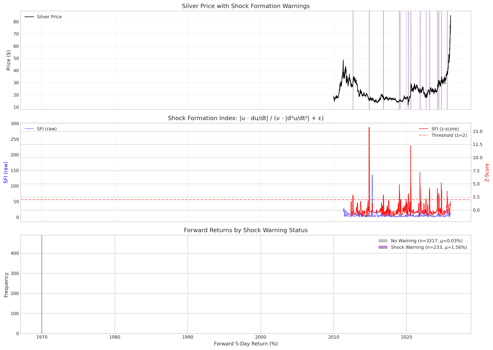
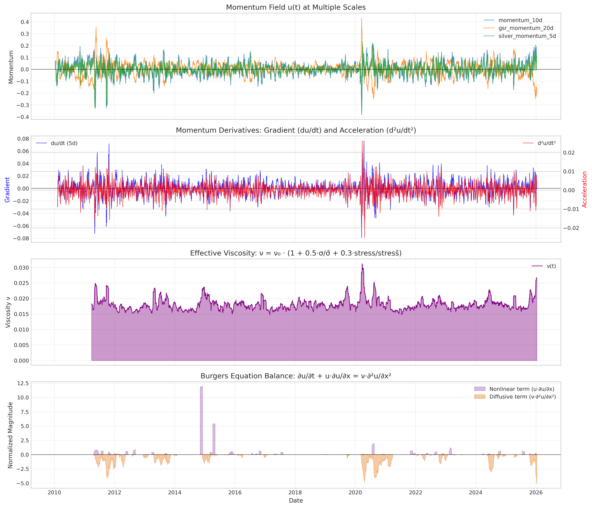
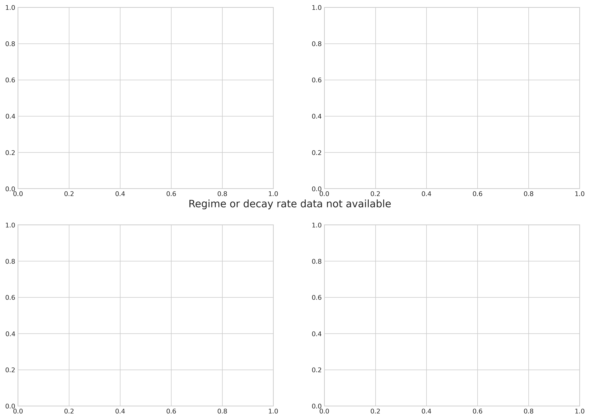
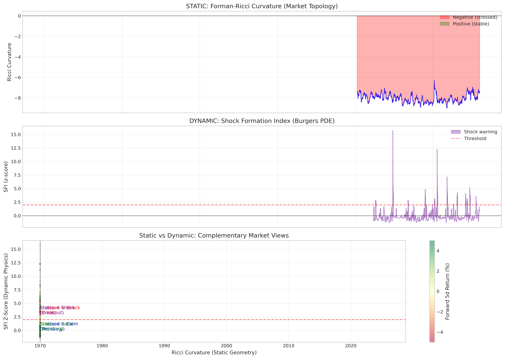
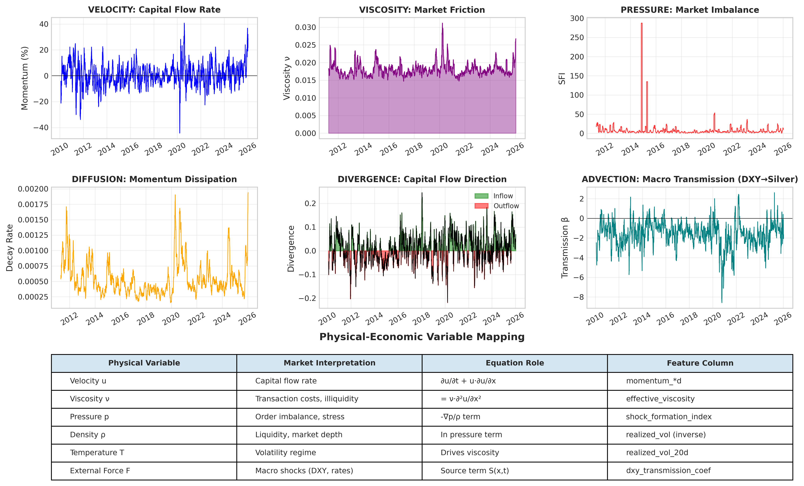
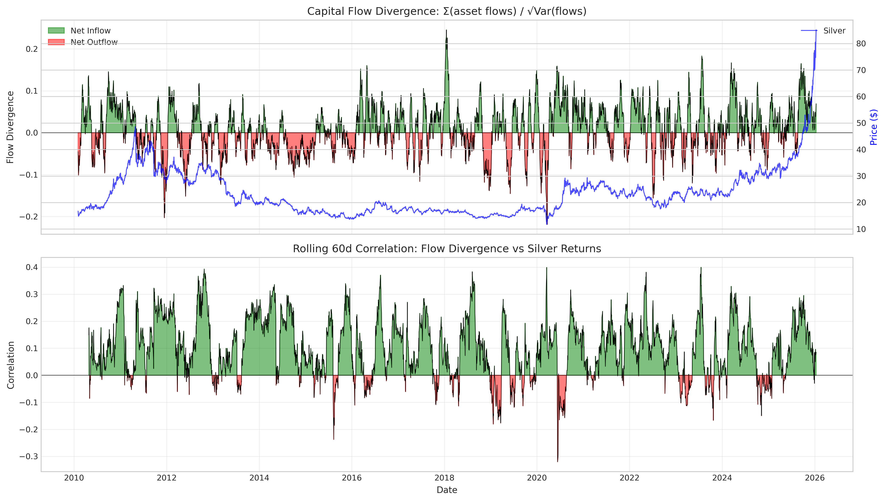
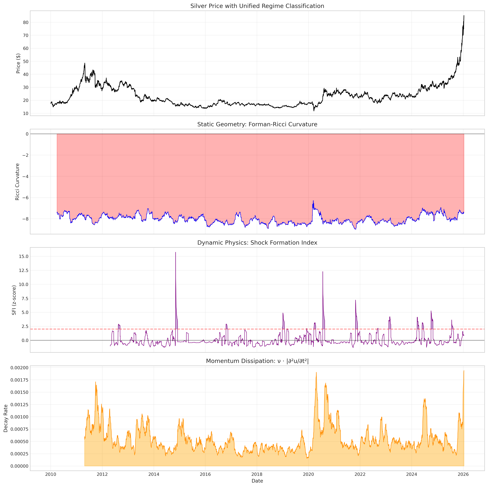

# Fluid Dynamics Analysis Report

Generated: 2026-01-17 01:17:51

## Executive Summary

This report demonstrates the application of **SPIKAN (Separable Physics-Informed Kolmogorov-Arnold Networks)** to market regime analysis. The key insight is that SPIKAN's fluid dynamics approach **complements** Ricci curvature by providing:

- **Static Geometry (Ricci)**: Current market structure/topology
- **Dynamic Physics (SPIKAN)**: How the market will evolve

## Key Findings

### Shock Detection

- Total shock warnings: **233**
- Warning rate: **6.7%** of observations

### Forward Returns by Shock Warning

| Condition | Mean 5d Return | Std Dev |
|-----------|----------------|----------|
| Shock Warning | 1.56% | 5.13% |
| No Warning | 0.03% | 3.97% |

### Feature Correlations with Forward 5d Returns

| Feature | Correlation |
|---------|-------------|
| shock_formation_index_z | 0.078 |
| momentum_decay_rate | 0.031 |
| effective_viscosity | 0.058 |
| flow_divergence | -0.002 |

## Burgers Equation Framework

The market dynamics are modeled using the Burgers equation:

$$\frac{\partial u}{\partial t} + u \cdot \frac{\partial u}{\partial x} = \nu \cdot \frac{\partial^2 u}{\partial x^2}$$

Where:
- **u**: Momentum field (capital velocity)
- **ν**: Effective viscosity (market friction)
- Left side: Nonlinear advection (momentum cascades)
- Right side: Viscous diffusion (momentum decay)

## Shock Formation Index (SFI)

The SFI measures the balance between nonlinear and diffusive terms:

$$SFI = \frac{|u \cdot du/dt|}{\nu \cdot |d^2u/dt^2| + \epsilon}$$

High SFI indicates shock formation (momentum is self-reinforcing faster than it dissipates).

## Figures

### Shock Formation Analysis

*Shock Formation Analysis with forward return validation*

### Burgers Equation Components

*Burgers Equation component decomposition*

### Momentum Decay Regimes

*Momentum decay patterns by geometric regime*

### Static Vs Dynamic

*Ricci curvature vs SFI complementarity*

### Economic Interpretation

*Physical-economic variable mapping*

### Flow Divergence

*Cross-asset capital flow analysis*

### Combined Regime Analysis

*Unified regime classification*

## Conclusion

The fluid dynamics framework provides actionable insights:

1. **Shock warnings** identify potential regime transitions before they occur
2. **Momentum decay rate** distinguishes trending vs mean-reverting periods
3. **Flow divergence** reveals cross-asset capital movements
4. Combined with Ricci curvature, provides complete market state assessment

---
*Report generated by SPIKAN Fluid Dynamics Analysis Pipeline*
